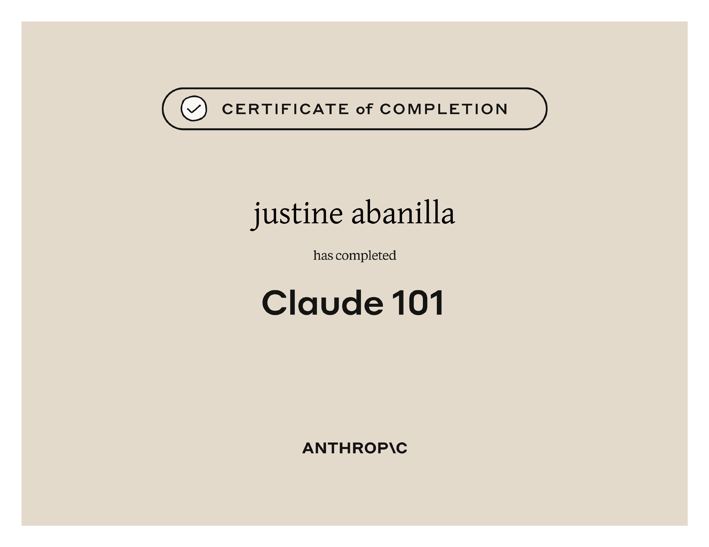

### Certificates

 
<table>
  <tr>
    <td align="center" width="50%">
      
       
      <b>DE0011892904299.pdf</b>
    </td>
    <td align="center" width="50%">
      
       
      <b>DEA0017292502517 (1).pdf</b>
    </td>
  </tr>
  <tr>
    <td align="center" width="50%">
      
       
      <b>PDA0018620324679.pdf</b>
    </td>
    <td align="center" width="50%">
      
       
      <b>SQA0014011767255.pdf</b>
    </td>
  </tr>
  <tr>
    <td align="center" width="50%">
      
       
      <b>certificate.pdf</b>
    </td>
    <td align="center" width="50%">
      
       
      <b>certificate-dvpgnvhvumfw-1785226723.pdf</b>
    </td>
  </tr>
  <tr>
    <td align="center" width="50%">
      
       
      <b>Profile _ freeCodeCamp.JS.org.pdf</b>
    </td>
    <td align="center" width="50%">
      
       
      <b>Profile _ freeCodeCamp.org.pdf</b>
    </td>
  </tr>
</table>
